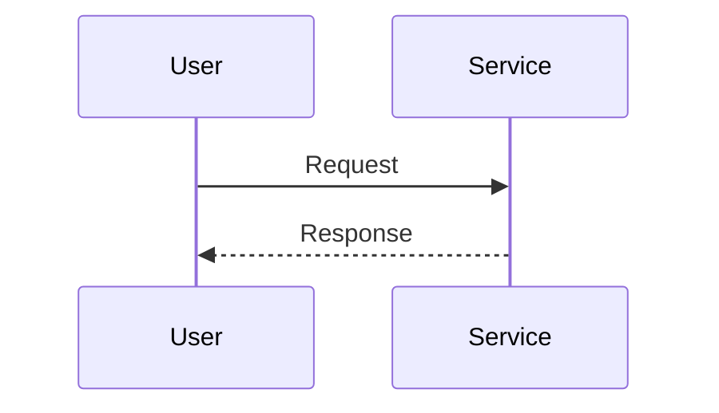

# Mini-Plan Proposal: <topic>

## Recommendation

State the proposed approach in one or two sentences.

## Proposed decisions

- Decision 1: proposed direction and rationale

## Proposed scope

- In scope

## Non-goals

- Out of scope

## Intended edits

- Repo or service
- Main change points

## Sequence diagram

Use a Mermaid sequence diagram when it clarifies request flow, ownership handoffs, rollout order, or system interactions. If a diagram would add no value, say so explicitly.

## Verification and risk sketch

Required for non-trivial proposals. Use at most 3 concrete bullets. Omit for tiny exact-edit proposals or when it adds no decision value.

## Open questions for approval

- Question 1
