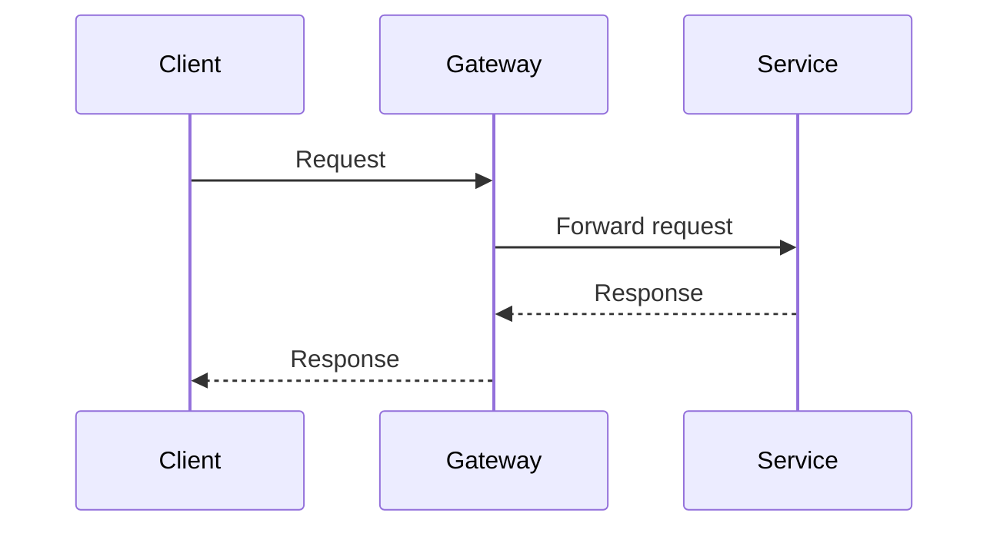

# Phased Plan Proposal: <topic>

## Recommendation

State the proposed approach in one or two sentences.

## Proposed design decisions

- Decision 1: proposed direction and rationale

## Proposed scope

- In scope

## Non-goals

- Out of scope

## Proposed phase structure

- Phase 1: goal
- Phase 2: goal

## Sequence diagram

Use a Mermaid sequence diagram when it clarifies request flow, ownership handoffs, rollout order, or system interactions. If a diagram would add no value, say so explicitly.

## Open questions for approval

- Question 1
