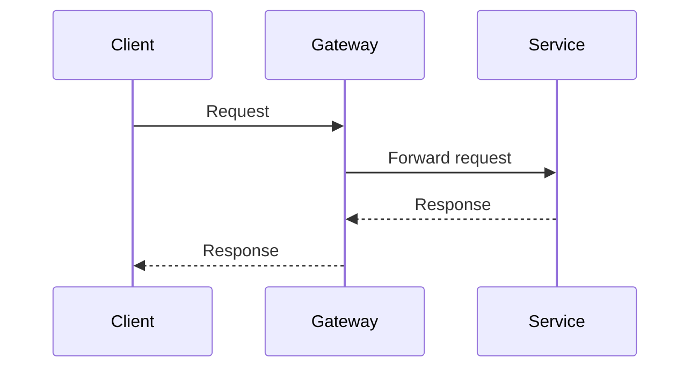

# Phased Plan: <topic>

## Goal

Describe the intended outcome.

## Design decisions

- Decision 1: resolved direction and rationale

## Scope

- In scope

## Non-goals

- Out of scope

## Phase status

- Phase 1: not started

## Implementation references

- Version-sensitive technology notes
- Official docs to reuse during implementation

## Sequence diagram

Use a Mermaid sequence diagram when it clarifies request flow, ownership handoffs, rollout order, or system interactions. If a diagram would add no value, say so explicitly.

## Phases

Repeat this phase block for each phase in the rollout.

### Phase 1

- Repos and services touched
- Ownership notes
- Contract impact
- Rollout order

#### Automated verification

- Check 1

#### Manual verification

- Check 1

## Rollback

- Containment or rollback step

## Traceability and risk

Use 1-3 concrete bullets. Each bullet must map to at least one of:

- a requirement and its phase, file, or verification
- a failure action: continue with bounded drift | return to planning | return to research | stop and ask
- a privacy/security impact, or `None identified` with rationale

Delete this section when it adds no traceability or decision value.

## Success criteria and exit conditions

- Criterion 1
